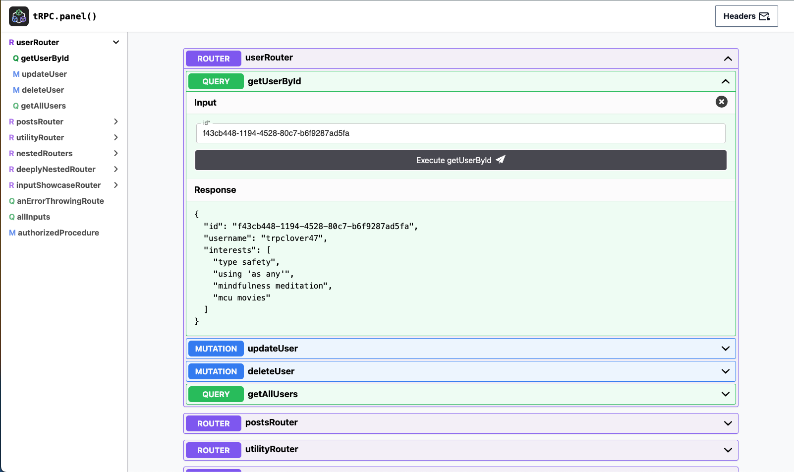

# tRPC Panel

tRPC Panel automatically generates a trpc native testing UI for your tRPC backend with one line of code with zero developer overhead:

You can check out the example app at [app.trpcpanel.io](https://app.trpcpanel.io)

# Documentation

Documentation has been moved to be entirely contained in our [github page](https://github.com/iway1/trpc-panel) (there's not enough documentation to need a full docsite currently, but if it becomes big enough we'll move back here).
